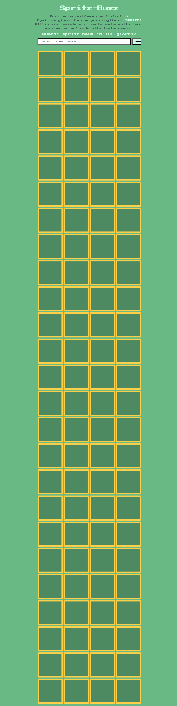
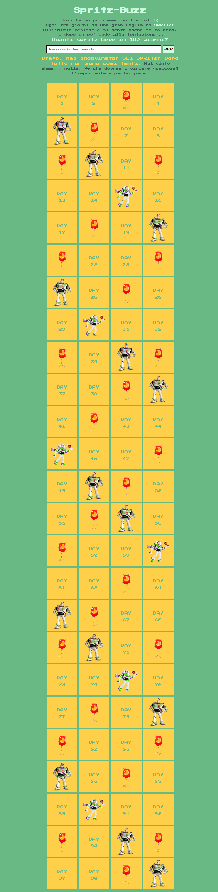

# Spritz-Buzz
This is one of my early JavaScript exercises. It's a variation of the classic <b>fizz-buzz</b> game, but I've adapted it to become <b>Spritz-Buzz</b>, inspired by the famous Venetian wine-based cocktail and Buzz Lightyear!   The objective is to hover your mouse over the cards to discover when Buzz enjoys his cocktail. If you can correctly guess how many cocktails Buzz drinks in 100 days, you win!   Feel free to play the game here:  https://enriconapolitano.github.io/js-fizzbuzzdom/

